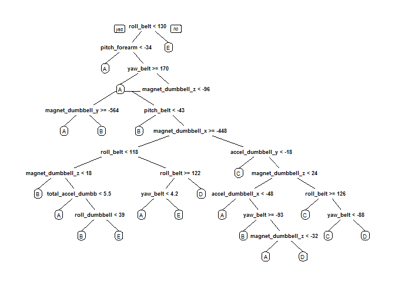
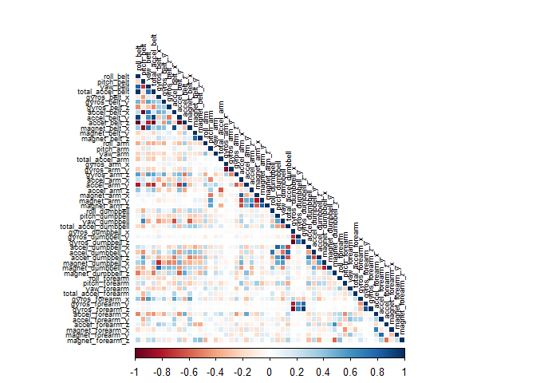
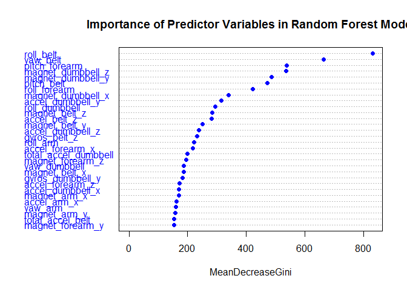

# Prediction Assignment Writeup
Dean Fantazzini  
22 March 2016  


## Introduction

The main goal of the project is to predict the manner in which 6 participants performed some exercise as discussed below. Using devices such as Jawbone Up, Nike FuelBand, and Fitbit it is now possible to collect a large amount of data about personal activity relatively inexpensively. These type of devices are part of the quantified self movement - a group of enthusiasts who take measurements about themselves regularly to improve their health, to find patterns in their behavior, or because they are tech geeks. One thing that people regularly do is quantify how much of a particular activity they do, but they rarely quantify how well they do it. 

The main goal of the project is to predict the manner in which 6 participants did the exercise by using data from accelerometers on the belt, forearm, arm, and dumbell.

## Data Loading and Exploratory Analysis

#### Load packages

```r
library(caret)
library(rpart)
library(rpart.plot)
library(randomForest)
library(corrplot)
library(rattle)
library(corrplot)
```


#### Download and load the data

```r
#Dowload the data
trainUrl <-"https://d396qusza40orc.cloudfront.net/predmachlearn/pml-training.csv"
testUrl <- "https://d396qusza40orc.cloudfront.net/predmachlearn/pml-testing.csv"
trainFile <- "./data/pml-training.csv"
testFile  <- "./data/pml-testing.csv"
if (!file.exists("./data")) {
    dir.create("./data")
}
if (!file.exists(trainFile)) {
    download.file(trainUrl, destfile=trainFile)
}
if (!file.exists(testFile)) {
    download.file(testUrl, destfile=testFile)
}
#Load the data
trainRaw <- read.csv("./data/pml-training.csv")
testRaw <- read.csv("./data/pml-testing.csv")
dim(trainRaw)
```

```
## [1] 19622   160
```

```r
dim(testRaw)
```

```
## [1]  20 160
```

#### Data cleaning


```r
# Remove columns with NA missing values.
trainRaw <- trainRaw[, colSums(is.na(trainRaw)) == 0] 
testRaw <- testRaw[, colSums(is.na(testRaw)) == 0] 

# Remove columns that do not contribute  to the accelerometer measurements.
classe <- trainRaw$classe
trainRemove <- grepl("^X|timestamp|window", names(trainRaw))
trainRaw <- trainRaw[, !trainRemove]
trainCleaned <- trainRaw[, sapply(trainRaw, is.numeric)]
trainCleaned$classe <- classe
testRemove <- grepl("^X|timestamp|window", names(testRaw))
testRaw <- testRaw[, !testRemove]
testCleaned <- testRaw[, sapply(testRaw, is.numeric)]
```

Finally, divide the cleaned training set into a pure training data set (70%) and a validation data set (30%). The validation data set will be used to conduct cross validation in the next steps.

```r
inTrain <- createDataPartition(trainCleaned$classe, p=0.70, list=F)
trainData <- trainCleaned[inTrain, ]
testData <- trainCleaned[-inTrain, ]
```

## Prediction Modelling

Three ML algorithms methods will be used: Random Forests, Decision Tree and Generalized Boosted Model. The best algorithm with higher accuracy will then be used with the Test dataset.

#### A) Random forest

The Random Forest algorithm automatically selects the important variables and is robust to correlated covariates & outliers in general. A 5-fold cross validation procedure will be used when employng this algorithm.


```r
set.seed(12345) # For reproducibile purpose
controlRf <- trainControl(method="cv", 5)
modelRf <- train(classe ~ ., data=trainData, method="rf", trControl=controlRf, ntree=250)
modelRf
```

```
## Random Forest 
## 
## 13737 samples
##    52 predictor
##     5 classes: 'A', 'B', 'C', 'D', 'E' 
## 
## No pre-processing
## Resampling: Cross-Validated (5 fold) 
## Summary of sample sizes: 10989, 10989, 10989, 10990, 10991 
## Resampling results across tuning parameters:
## 
##   mtry  Accuracy   Kappa      Accuracy SD  Kappa SD   
##    2    0.9889352  0.9859998  0.002801821  0.003547687
##   27    0.9902458  0.9876601  0.001878355  0.002376324
##   52    0.9855142  0.9816731  0.003491601  0.004419486
## 
## Accuracy was used to select the optimal model using  the largest value.
## The final value used for the model was mtry = 27.
```

The performance of the model is evaluated on the validation data set and the confusion matrix and associated statistics are computed:

```r
predictRf <- predict(modelRf, testData)
confusionMatrix(testData$classe, predictRf)
```

```
## Confusion Matrix and Statistics
## 
##           Reference
## Prediction    A    B    C    D    E
##          A 1667    6    1    0    0
##          B    8 1128    3    0    0
##          C    0    3 1017    6    0
##          D    0    0    6  957    1
##          E    0    0    1    1 1080
## 
## Overall Statistics
##                                           
##                Accuracy : 0.9939          
##                  95% CI : (0.9915, 0.9957)
##     No Information Rate : 0.2846          
##     P-Value [Acc > NIR] : < 2.2e-16       
##                                           
##                   Kappa : 0.9923          
##  Mcnemar's Test P-Value : NA              
## 
## Statistics by Class:
## 
##                      Class: A Class: B Class: C Class: D Class: E
## Sensitivity            0.9952   0.9921   0.9893   0.9927   0.9991
## Specificity            0.9983   0.9977   0.9981   0.9986   0.9996
## Pos Pred Value         0.9958   0.9903   0.9912   0.9927   0.9982
## Neg Pred Value         0.9981   0.9981   0.9977   0.9986   0.9998
## Prevalence             0.2846   0.1932   0.1747   0.1638   0.1837
## Detection Rate         0.2833   0.1917   0.1728   0.1626   0.1835
## Detection Prevalence   0.2845   0.1935   0.1743   0.1638   0.1839
## Balanced Accuracy      0.9968   0.9949   0.9937   0.9957   0.9993
```

```r
accuracyRf <- postResample(predictRf, testData$classe)
accuracyRf
```

```
##  Accuracy     Kappa 
## 0.9938828 0.9922624
```

```r
ooseRf <- 1 - as.numeric(confusionMatrix(testData$classe, predictRf)$overall[1])
ooseRf
```

```
## [1] 0.006117247
```

#### B) Decision Trees


```r
set.seed(12345)
modFitDecTree <- rpart(classe ~ ., data=trainData, method="class")
prp(modFitDecTree)
```



The performance of the model is evaluated on the validation data set and the confusion matrix and associated statistics are computed:

```r
predictDecTree <- predict(modFitDecTree, testData, type="class")
confusionMatrix(testData$classe, predictDecTree)
```

```
## Confusion Matrix and Statistics
## 
##           Reference
## Prediction    A    B    C    D    E
##          A 1471   75   38   63   27
##          B  155  715  140   44   85
##          C   47   84  673  191   31
##          D   61   66   61  648  128
##          E   21   68  108   94  791
## 
## Overall Statistics
##                                           
##                Accuracy : 0.7303          
##                  95% CI : (0.7188, 0.7416)
##     No Information Rate : 0.2982          
##     P-Value [Acc > NIR] : < 2.2e-16       
##                                           
##                   Kappa : 0.6585          
##  Mcnemar's Test P-Value : < 2.2e-16       
## 
## Statistics by Class:
## 
##                      Class: A Class: B Class: C Class: D Class: E
## Sensitivity            0.8382   0.7093   0.6598   0.6231   0.7448
## Specificity            0.9508   0.9131   0.9274   0.9348   0.9397
## Pos Pred Value         0.8787   0.6277   0.6559   0.6722   0.7311
## Neg Pred Value         0.9326   0.9383   0.9286   0.9203   0.9436
## Prevalence             0.2982   0.1713   0.1733   0.1767   0.1805
## Detection Rate         0.2500   0.1215   0.1144   0.1101   0.1344
## Detection Prevalence   0.2845   0.1935   0.1743   0.1638   0.1839
## Balanced Accuracy      0.8945   0.8112   0.7936   0.7789   0.8422
```

```r
accuracyDecTree <- postResample(predictDecTree, testData$classe)
accuracyDecTree
```

```
##  Accuracy     Kappa 
## 0.7303314 0.6585079
```

```r
ooseDecTree <- 1 - as.numeric(confusionMatrix(testData$classe, predictDecTree)$overall[1])
ooseDecTree
```

```
## [1] 0.2696686
```

#### C) Generalized Boosted Model


```r
set.seed(12345)
controlGBM <- trainControl(method = "repeatedcv", number = 5, repeats = 1)
modFitGBM  <- train(classe ~ ., data=trainData, method = "gbm",
                    trControl = controlGBM, verbose = FALSE)
modFitGBM
```

```
## Stochastic Gradient Boosting 
## 
## 13737 samples
##    52 predictor
##     5 classes: 'A', 'B', 'C', 'D', 'E' 
## 
## No pre-processing
## Resampling: Cross-Validated (5 fold, repeated 1 times) 
## Summary of sample sizes: 10989, 10989, 10989, 10990, 10991 
## Resampling results across tuning parameters:
## 
##   interaction.depth  n.trees  Accuracy   Kappa      Accuracy SD
##   1                   50      0.7480531  0.6806050  0.003493781
##   1                  100      0.8172813  0.7687366  0.007796664
##   1                  150      0.8524422  0.8132607  0.003697533
##   2                   50      0.8547719  0.8160088  0.005639776
##   2                  100      0.9042735  0.8788471  0.004114326
##   2                  150      0.9297520  0.9110729  0.005227605
##   3                   50      0.8945194  0.8664297  0.006429165
##   3                  100      0.9398710  0.9238909  0.005581551
##   3                  150      0.9591611  0.9483221  0.003431679
##   Kappa SD   
##   0.004440267
##   0.009747923
##   0.004679088
##   0.007250074
##   0.005289198
##   0.006668585
##   0.008217547
##   0.007097544
##   0.004357159
## 
## Tuning parameter 'shrinkage' was held constant at a value of 0.1
## 
## Tuning parameter 'n.minobsinnode' was held constant at a value of 10
## Accuracy was used to select the optimal model using  the largest value.
## The final values used for the model were n.trees = 150,
##  interaction.depth = 3, shrinkage = 0.1 and n.minobsinnode = 10.
```

The performance of the model is evaluated on the validation data set and the confusion matrix and associated statistics are computed:

```r
predictGBM <- predict(modFitGBM , testData)
confusionMatrix(testData$classe, predictGBM)
```

```
## Confusion Matrix and Statistics
## 
##           Reference
## Prediction    A    B    C    D    E
##          A 1638   28    8    0    0
##          B   25 1081   29    2    2
##          C    0   26  985   13    2
##          D    0    1   34  925    4
##          E    2    7    7   21 1045
## 
## Overall Statistics
##                                           
##                Accuracy : 0.9641          
##                  95% CI : (0.9591, 0.9687)
##     No Information Rate : 0.2829          
##     P-Value [Acc > NIR] : < 2.2e-16       
##                                           
##                   Kappa : 0.9547          
##  Mcnemar's Test P-Value : NA              
## 
## Statistics by Class:
## 
##                      Class: A Class: B Class: C Class: D Class: E
## Sensitivity            0.9838   0.9458   0.9266   0.9625   0.9924
## Specificity            0.9915   0.9878   0.9915   0.9921   0.9923
## Pos Pred Value         0.9785   0.9491   0.9600   0.9595   0.9658
## Neg Pred Value         0.9936   0.9869   0.9839   0.9927   0.9983
## Prevalence             0.2829   0.1942   0.1806   0.1633   0.1789
## Detection Rate         0.2783   0.1837   0.1674   0.1572   0.1776
## Detection Prevalence   0.2845   0.1935   0.1743   0.1638   0.1839
## Balanced Accuracy      0.9876   0.9668   0.9591   0.9773   0.9924
```

```r
accuracyGBM <- postResample(predictGBM, testData$classe)
accuracyGBM
```

```
##  Accuracy     Kappa 
## 0.9641461 0.9546609
```

```r
ooseGBM <- 1 - as.numeric(confusionMatrix(testData$classe, predictGBM)$overall[1])
ooseGBM
```

```
## [1] 0.03585387
```

## Apply the best model to the Test data set
The accuracy of the 3 ML algorithm were:

Random Forest : 0.993

Decision Tree : 0.758

GBM : 0.962

Therefore, we will employ the Random Forest model to the original testing data set downloaded from the data source to predict the 20 quiz results:

```r
# The problem_id column is removed
result <- predict(modelRf, testCleaned[, -length(names(testCleaned))])
result
```

```
##  [1] B A B A A E D B A A B C B A E E A B B B
## Levels: A B C D E
```

## Appendix

The correlation matrix between the variables is displayed below.
A good set of variables should not be highly correlated: given that the computed correlations below are not too high,  PCA (Principal Components Analysis)  pre-processing were not performed.


```r
corrPlot <- cor(trainData[, -length(names(trainData))])
corrplot(corrPlot, method = "color", type = "lower", 
         tl.cex = 0.55, tl.col = rgb(0, 0, 0))
```



Finally, the variable importance across classes in the Random Forest model for the top 20 most important variables is reported below:

```r
 modelRf <- randomForest(classe ~ ., data=trainData, method="rf", trControl=controlRf, ntree=250)
varImpPlot(modelRf, sort = TRUE, pch = 19, col = 12, cex = 1, main = "Importance of Predictor Variables in Random Forest Model")
```


